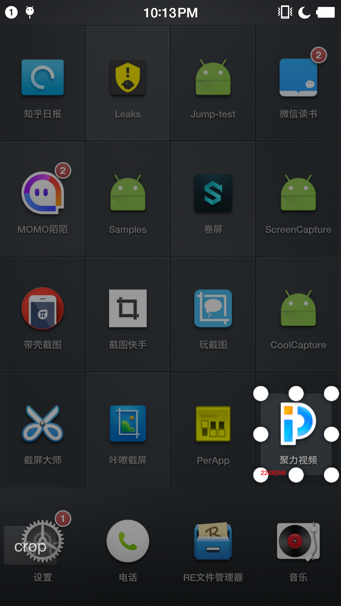

# CoolCapture
在非root Android 5.0 及以上手机上实现截图功能。

## 例子

摇晃手机进入截图界面。

 

选择区域以后点击`crop`截图。

 

## 问题

在`Genymotion`的模拟器上面一直报错，没有解决。

```
 java.lang.UnsupportedOperationException: The producer output buffer format 0x2 doesn't match the ImageReader's configured buffer format 0x1.
     at android.media.ImageReader.nativeImageSetup(Native Method)
     at android.media.ImageReader.acquireNextSurfaceImage(ImageReader.java:336)
     at android.media.ImageReader.acquireNextImage(ImageReader.java:390)
     at android.media.ImageReader.acquireLatestImage(ImageReader.java:283)
```